# KTX Image Classification | 한국고속철도 이미지 분석
## Contributors: 
- ### Louis Sungwoo Cho | 조성우

# Project Description
This project is about image classifcation of the high-speed trains in South Korea, analyzing and forecasting KTX (Korea Train eXpress) (한국고속철도) and SRT (Super Rapid Train) (수도권고속철도) passenger ridership and the utility rate. Random image datasets were given into the neural network model. The combined passenger ridership datasets used for analyzing and forecasting were acquired from KORAIL (한국철도공사) and SRT (수서고속철도주식회사). 

**KTX-1 the original French TGV model high-speed train approaching a station. 
역으로 들어오는 프랑스에서 제작한 TGV 모델 KTX-1 고속열차.**
- #### Image Source: [Korea Train Express Wikipedia](https://en.wikipedia.org/wiki/Korea_Train_Express)

**KTX-Sancheon model developed by Hyundai ROTEM traveling along the Gangneung Line. 
강릉선을 고속으로 주행하는 현대로템에서 제작한 KTX-산천 고속열차.**
- ##### Image Source: [archyworldys KTX-EUM](https://www.archyworldys.com/only-56-minutes-from-cheongnyangni-to-jecheon-the-faster-and-strongerbullet-train-comes/)

**KTX-EUM model developed by Hyundai ROTEM passing Yangsu Bridge of the Jungang Line. 
중앙선 양수철교 구간을 고속으로 통과하는 현대로템에서 제작한 KTX-이음 고속열차.**
- #### Image Source: [Greenpostkorea](http://www.greenpostkorea.co.kr/news/articleView.html?idxno=69229)

**SRT train developed by Hyundai ROTEM passing Pyeongtaek Jije Station.  
평택지제역을 통과하는 현대로템에서 제작한 SRT 고속열차.**
- #### Image Source: [Srail Photo](https://www.srail.or.kr/cms/article/view.do?postNo=39&pageId=KR0502000000)

# Motivation
South Korea first opened their high-speed rail network on April 1st, 2004 to make rail travel time more fast and convenient. When I first traveled to South Korea, I still remember when I took KTX with my family for the first time when we went to Busan. I was excited to ride the high-speed train because the U.S does not have bullet trains which can travel as fast as the KTX trains. After nearly 2 decades the first KTX line the Gyeongbu High-Speed Line (경부고속철도) connecting Seoul to Busan opened, the high-speed rail network has expanded almost throughout the entire country including the Honam High-Speed Line (호남고속철도) connecting Seoul to Gwangjusongjeong to Mokpo, Suseo/Sudogwon High-Speed Line (수서/수도권고속철도) connecting the south side of Seoul Suseo to Busan to Gwangju to Mokpo, Gyeongjeon Line (경전선) connecting Seoul to Masan to Jinju, Jeolla Line (전라선) connecting Seoul to Yeosu-EXPO, Donghae Line (동해선) connecting Seoul to Pohang, Gangneung Line (강릉선) also known as the 2018 Pyeongchang Olympics Line connecting Seoul to Gangneung, Yeongdong Line (영동선) connecting Seoul to Donghae, Jungang Line (중앙선) connecting Seoul to Andong (sections to Uiseong, Yeongcheon, Gyeongju, Taehwagang, Busan-Bujeon to be opened in December 2024), and the Jungbunaeryuk Line (중부내륙선) connecting Bubal to Chungju. KTX lines to Incheon (인천발 KTX) and Suwon (수원발 KTX) will open in 2025. As seen above, due to the continuing expansion of the South Korean high-speed train network, Hyundai ROTEM has designed many different types of variants to serve in various lines depending on their operational speed respectively. Due to each locomotive having unique features, I decided to create a deep learning model that can classify the 4 types of trains: KTX-1, KTX-EUM, KTX-Sancheon, and SRT. 

#### From left to right KTX-1, KTX-Sancheon, SRT, KTX-EUM (왼쪽부터 KTX-1, KTX-산천, SRT, KTX-이음)
- #### Image Source: [KTX by years](https://www.youtube.com/watch?v=pSFV4Nh2hJo)

### Map of the entire high-speed rail network in South Korea (대한민국 고속철도망)
- #### Image Source: [Incheon Today KTX Routes](https://www.incheontoday.com/news/articleView.html?idxno=205643)

# High-Speed Train Information
The following section includes the information for each train with their vehicle specifications. KTX stands for Korea Train eXpress and SRT stands for Super Rapid Train.
# KTX-1
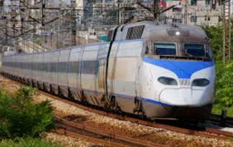

**Manufacturer: Alstom & Hyundai ROTEM 
Family: TGV 
Entered Service: April 2004 
Operator: KORAIL 
Lines Served: Gyeongbu HSR, Honam HSR, Gyeongjeon, Jeolla, Donghae 
Maximum Operating Speed: 305 km/h 
Maximum Design Speed: 330 km/h 
Electricity: 25 kV AC 60 Hz Catenary 
Current Collector: Pantograph 
Safety System: ATS, ATP, TVM-430 
Track Gauge: 1435 mm Standard Gauge **

# KTX-Sancheon KTX-산천
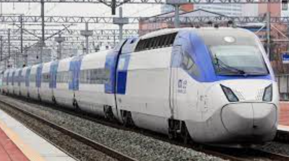

**Manufacturer: Hyundai ROTEM 
Family: KTX 
Entered Service: March 2010 
Operator: KORAIL 
Lines Served: Gyeongbu HSR, Honam HSR, Gyeongjeon, Jeolla, Donghae 
Maximum Operating Speed: 305 km/h 
Maximum Design Speed: 330 km/h 
Electricity: 25 kV AC 60 Hz Catenary 
Current Collector: Pantograph 
Safety System: ATS, ATP, TVM-430 
Track Gauge: 1435 mm Standard Gauge **

# SRT
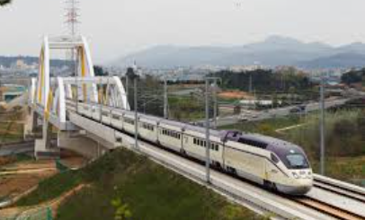

**Manufacturer: Hyundai ROTEM 
Family: KTX 
Entered Service: December 2016 
Operator: SR Corporation 
Lines Served: Suseo HSR, Gyeongbu HSR, Honam HSR, Gyeongjeon, Jeolla 
Maximum Operating Speed: 305 km/h 
Maximum Design Speed: 330 km/h 
Electricity: 25 kV AC 60 Hz 
Current Collector: Pantograph 
Safety System: ATS, ATP, TVM-430 
Track Gauge: 1435 mm Standard Gauge **

# KTX-EUM KTX-이음
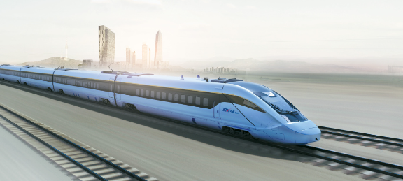

**Manufacturer: Hyundai ROTEM 
Family: KTX 
Entered Service: January 2021 
Operator: KORAIL 
Lines Served: Gangneung, Jungang, Jungbunaeryuk, Seohae (Planned) 
Maximum Operating Speed: 260 km/h 
Maximum Design Speed: 286 km/h 
Electricity: 25 kV AC 60 Hz Catenary 
Current Collector: Pantograph 
Safety System: ATS, ATP, TVM-430 
Track Gauge: 1435 mm Standard Gauge **

## Information Sources:
- ##### [KTX-1 Wikipedia Article](https://en.wikipedia.org/wiki/KTX-I)
- ##### [KTX-Sancheon Wikipedia Article](https://en.wikipedia.org/wiki/KTX-Sancheon)
- ##### [SRT Wikipedia Article](https://en.wikipedia.org/wiki/Super_Rapid_Train)
- ##### [KTX-EUM Wikipedia Article](https://en.wikipedia.org/wiki/KTX-Eum)

# Image Preparation
Images of the 4 different types of Korean high-speed trains were split into training and testing datasets. All of the images were resized to 64 by 64 pixels. Transformations were applied to both the training and testing data.

# Convolutional Neural Network (CNN) Model
Convolutional Neural Network (CNN) model was used to classify the high-speed train images. One of the biggest advantage of using CNN models is that the neural network is able to detect the important features into several distinct classes from the given image datasets without any human supervision and also being much more accurate and computationally efficient than Artifcial Neural Networks (ANN). Hence, this deep learning model was chosen to train all the high-speed trains image datasets for this project. 

#### Figure 1. above shows how the cnn model processes the image dataset with series of convolution and pooling before flattening out the image to predict the output.

The model used for this project performs multiclass classification so the output is set to be softmax. But why is convolution so crucial in image classification? Convolution is a set of mathematical operations performed by the computer to merge two pieces of critical information from the image. A feature map for the images is produced using a 'convolution filter'. 

#### Figure 2. above shows how the convolution filter produces the feature map.

The convolution operation is then performed by splitting the 3 by 3 matrix into merged 3 by 3 matrix by doing an element-wise matrix multiplication and summing the total values. 

#### Figure 3. above shows the matrix operation of the convolution filter.

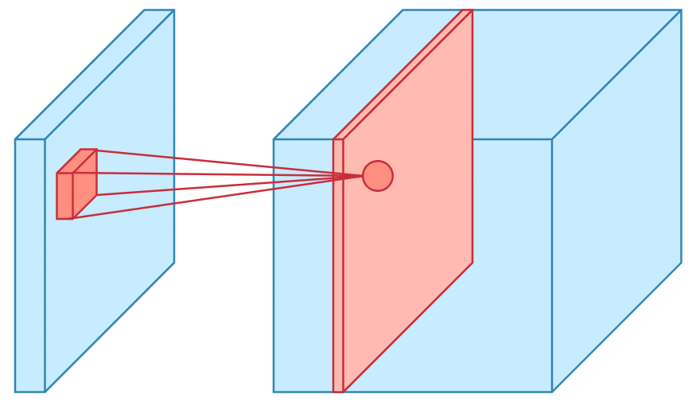
#### Figure 4. above shows the visualization of the  convolution input of the image.

Once all the convolution has been performed on the image datasets, pooling is then used to reduce the dimensions, a crucial step to enable reducing the number of parameters shortening the training time and preventing overfitting. Maximum pooling was used for this model which only uses the maximum value from the pooling window. 

#### Figure 5. above shows the pooling of the processed image in a 2 by 2 window.

#### Figure 6. above shows the pooling of the processed image in a 3 by 3 window.

Finally after adding all the convolution and pooling layers, the entire 3D tensor is flatten out to be a 1D vector into a fully connected layer to produce the output. 
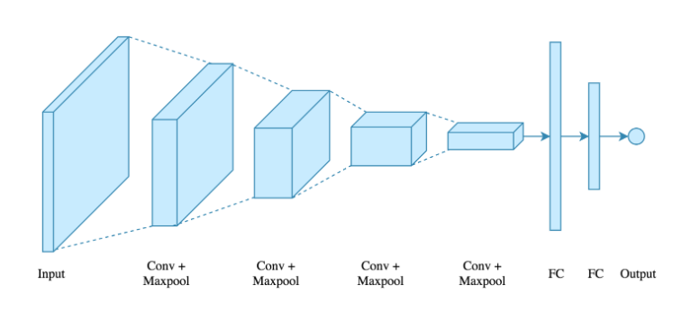
#### Figure 7. above shows the visual implementation of the CNN model. 

##### Original Source for the CNN Explanation: [Towarddatascience Applied Deep Learning](https://towardsdatascience.com/applied-deep-learning-part-4-convolutional-neural-networks-584bc134c1e2#:~:text=The%20main%20advantage%20of%20CNN,CNN%20is%20also%20computationally%20efficient)

# Results
Once the CNN model was built for image classification training with a given number of training steps also known as epochs set to 20, the accuracy score graph and the loss score graph with respect to each epoch step were plotted. 

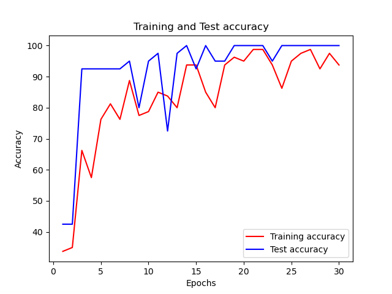
#### Figure 8. above shows the accuracy score of the CNN model with respect to the number of steps. 

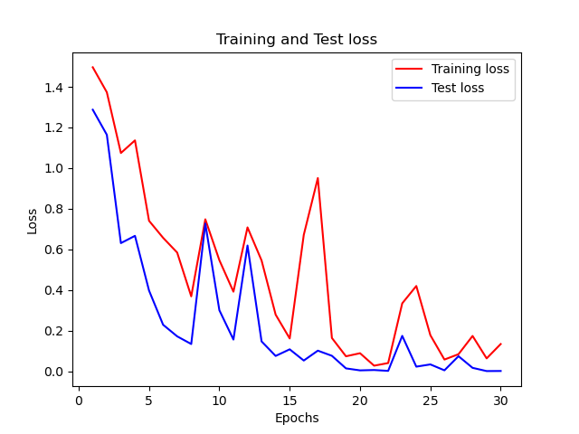
#### Figure 9. above shows the loss score of the CNN model with respect to the number of steps. 

According to the plots above, the train accuracy is very close to the testing accuracy as the number of epochs gradually increases. Overall, the model has produced a relatively high training accuracy. The number of losses meaning the error between the actual image and the predicted image decreases as more number of epochs are given into the model. This means that the chance of predicting a given image dataset accurately is very high. 

# Prediction
Once all the image datasets have been processed and the accuracy and loss score have been analyzed, a few set of images were given into the model to determine whether the model is accurate enough predicting the train type of a given image. Testing datasets were given into the model and the predictor plots the actual image respectively. 

#### Figure 10. above shows the predicted output of each image data given into our model.

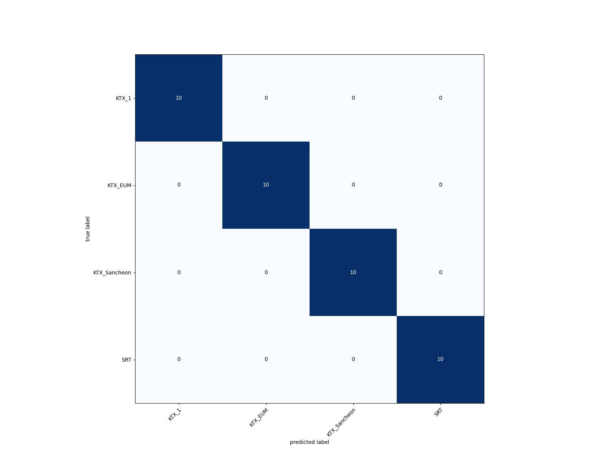
#### Figure 11. above shows the confusion matrix our model.

From the predicted images and the confusion matrix above, it is clearly evident that the predictor estimates the train class very accurately. This means that the results have turned out very well. Overall, the model performed very well with all the high-speed train image datasets.

# Passenger Ridership Analysis
This was the second part of the project. Datasets that include total passengers of each high-speed line and utility rate acquired from KTX and SRT were used to analyze and forecast total passengers ridership and utility rate. The number of passengers is represented in thousands.
- #### Dataset Source: [Index.go.kr KTX Data](https://www.index.go.kr/potal/main/EachDtlPageDetail.do?idx_cd=1252)

### Utility Rate (UR) Formula:
- ##### passnum = actual number of passengers in thousands who boarded the train
- ##### availseats = number of seats available

$$ UR\ =\ \frac{passnum}{availseats} \*\ 100 \\% \ $$

This is the formula defined by both KTX and SRT companies and the utility rate datasets were already calculated and given in the raw data so no extra work had to be done to compute the UR value for each high-speed train line. 

# Data Visualization and Forecasting

Because there are too many variables to plot in one graph from the raw data, two new dataframes have been created to analyze and forecast the total number of passengers on each line and utility rate. 

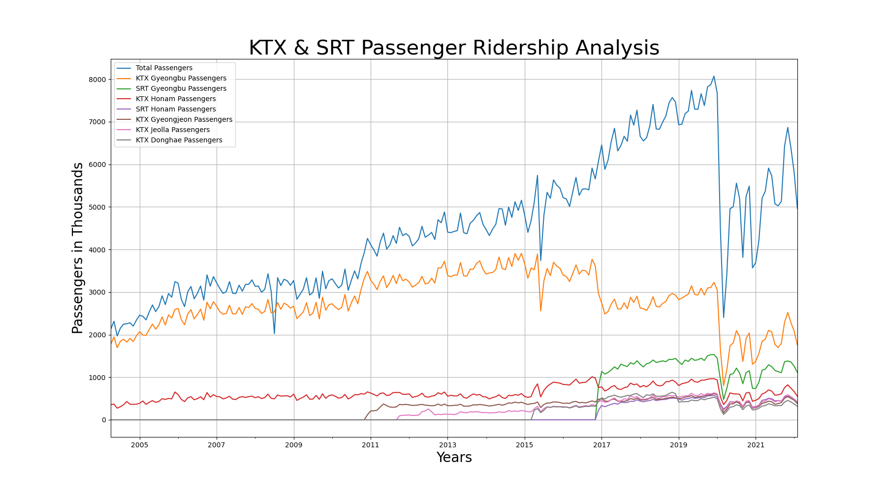
#### Figure 12. above shows the number of passengers for the total and the total passengers for each month.

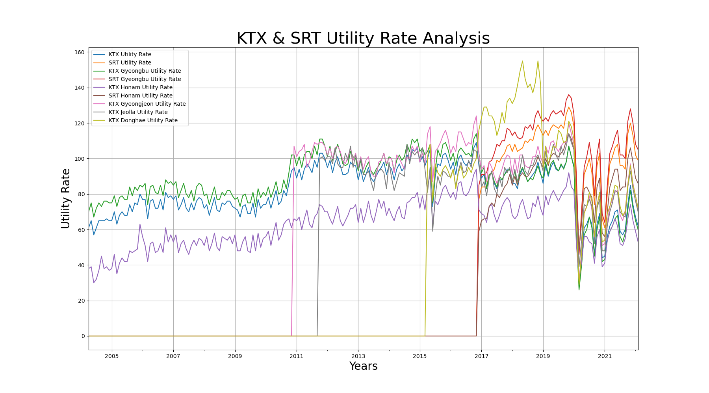
#### Figure 13. above shows the utility rate for each line and the total utility rate of each train for each month.

#### Forecasted Total Passengers
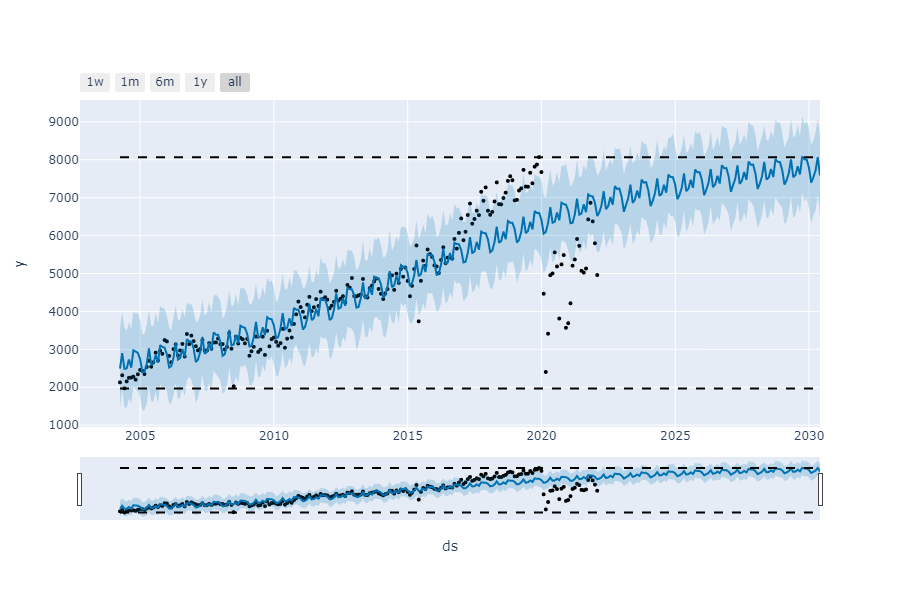

#### Forecasted KTX Gyeongbu HSR Passengers
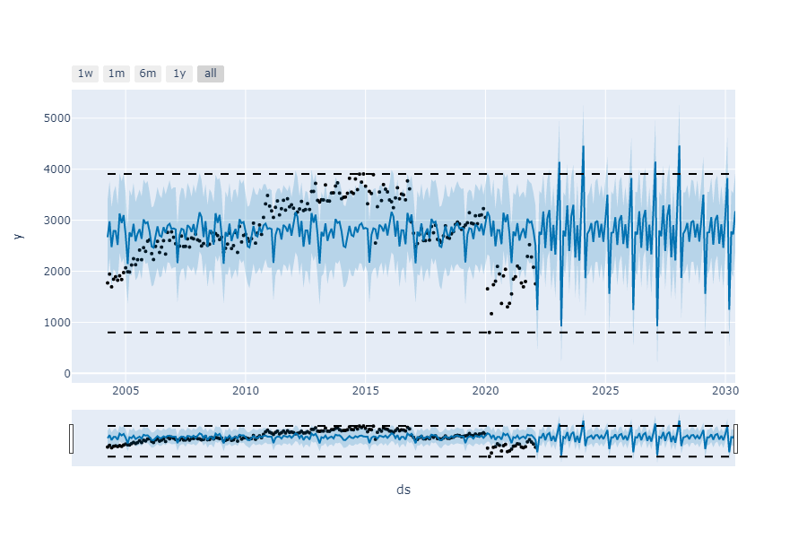

#### Forecasted SRT Gyeongbu HSR Passengers

#### Forecasted KTX Honam HSR Passengers

#### Forecasted SRT Honam HSR Passengers
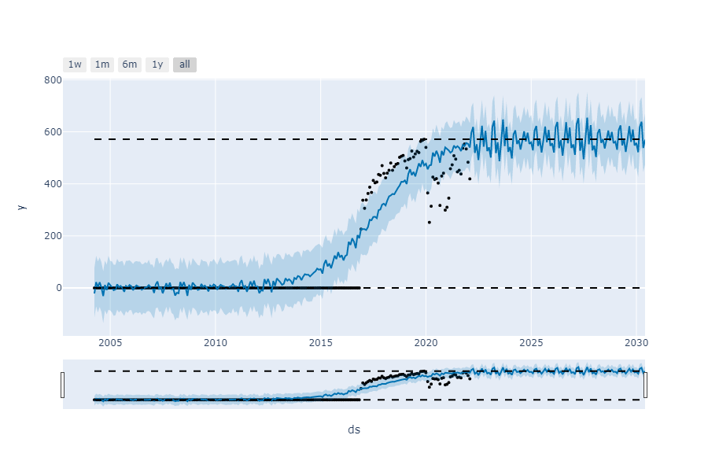

#### Forecasted KTX Gyeongjeon Line Passengers

#### Forecasted KTX Jeolla Line Passengers
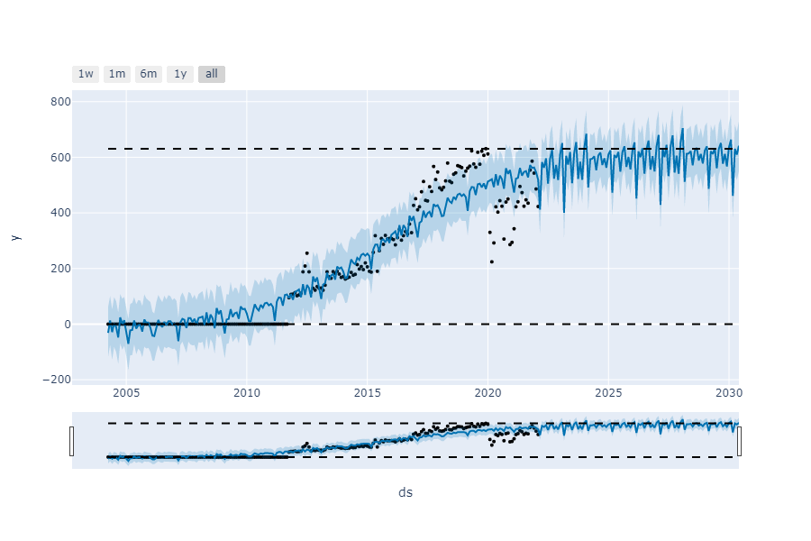

#### Forecasted KTX Donghae Line Passengers
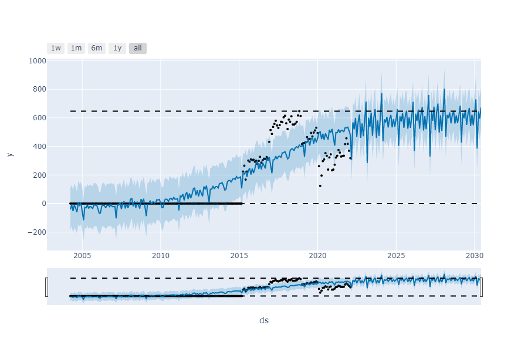

#### Figure 14. above shows the forecasted passenger volumes until 2030.

#### Forecasted KTX Utility Rate
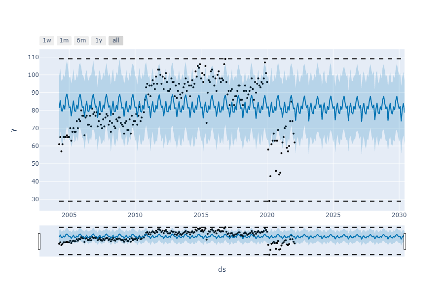

#### Forecasted SRT Utility Rate

#### Forecasted KTX Gyeongbu HSR Utility Rate
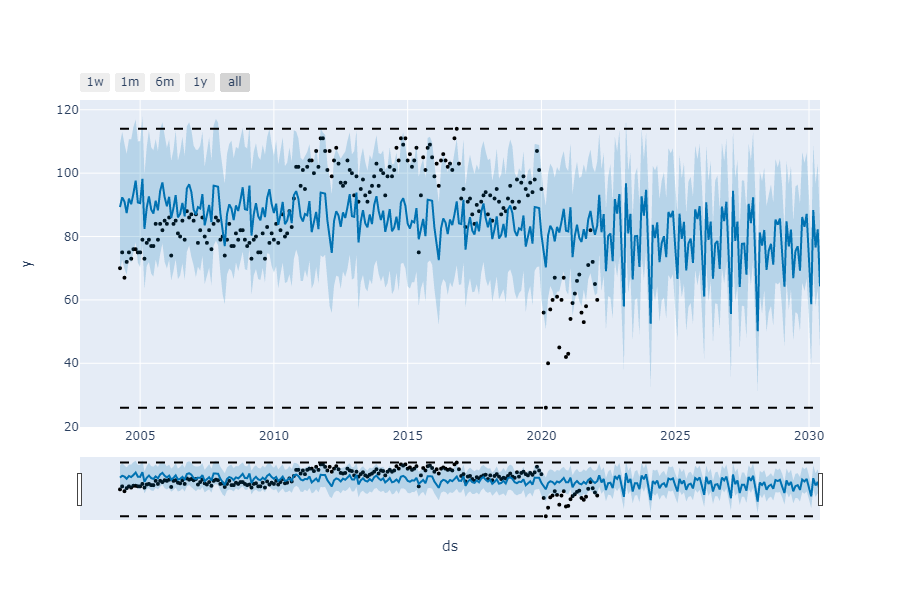

#### Forecasted SRT Gyeongbu HSR Utility Rate
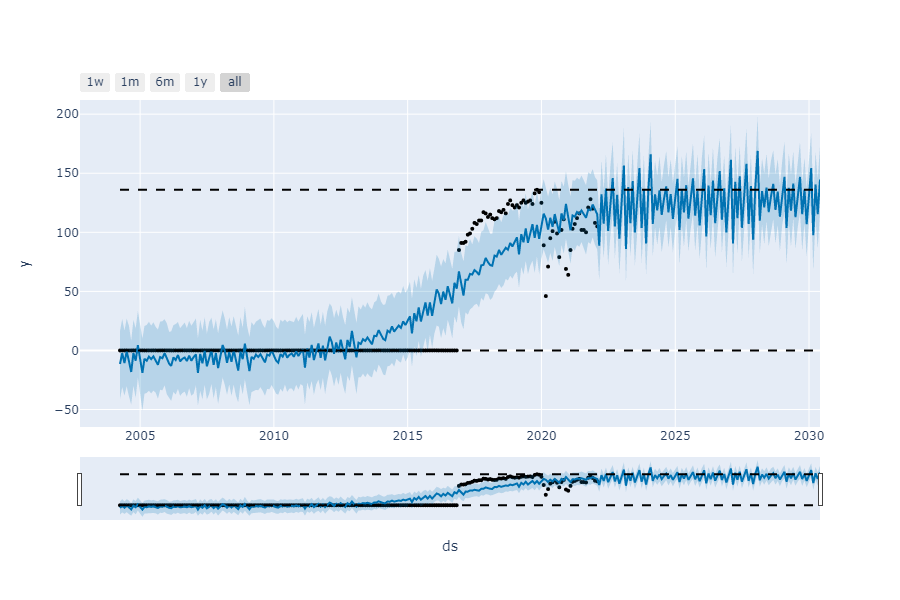

#### Forecasted KTX Honam HSR Utility Rate
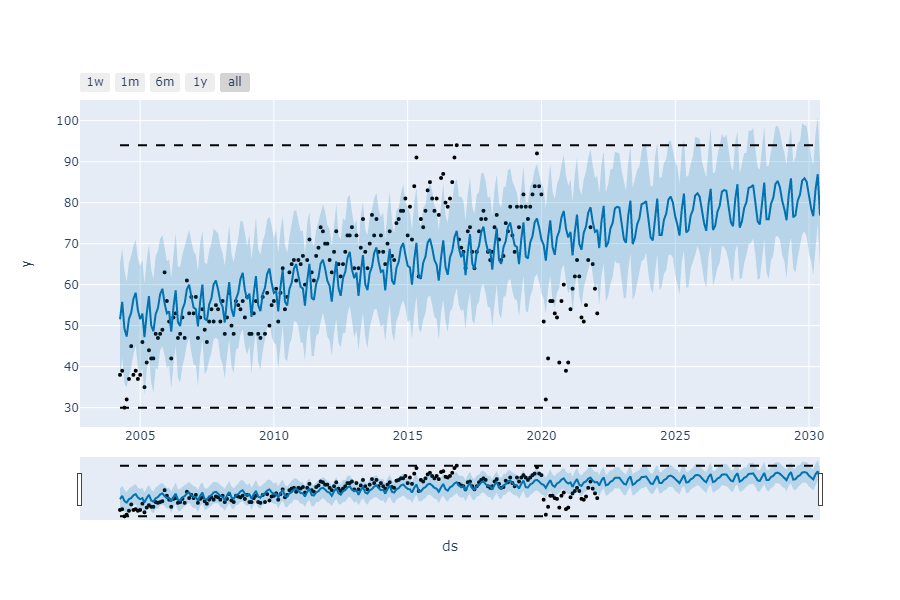

#### Forecasted SRT Honam HSR Utility Rate
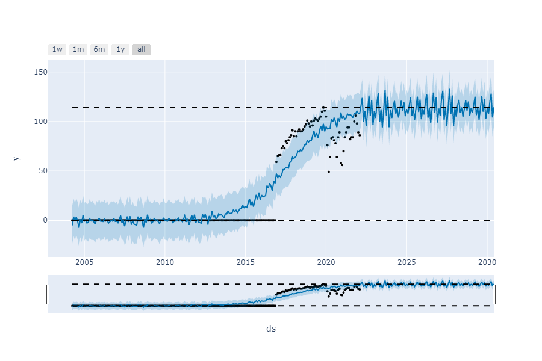

#### Forecasted KTX Gyeongjeon Line Utility Rate

#### Forecasted KTX Jeolla Line Utility Rate

#### Forecasted KTX Donghae Line Utility Rate

#### Figure 15. above shows the forecasted utility rates respectively until 2030.

# Conclusive Remarks
Overall, the convolutional neural network model used for image classification has performed very well classifying the 4 different types of Korean high-speed trains: KTX-1, KTX-EUM, KTX-Sancheon, and SRT. It is very evident that Convolutional Neural Networks have strong computational power while producing accurate results when classifying the images. More epochs and more layers overall improved the accuracy for this model. For further improvements in image classification, adding more complex samples to the model will be considered. 

The time-series forecasting model in general has predicted a positive trend and made appropriate trends overall for each high-speed train lines in terms of both passenger ridership and utility rate. Overall, SRT Gyeongbu HSR and Honam HSR passenger riderships have been increasing more compared to KTX Gyeongbu HSR and Honam HSR lines. It is expected that the ridership of KTX Gyeongbu HSR and Honame HSR lines would be steady. This shows that the demand for high-speed trains in South Korea is very high.

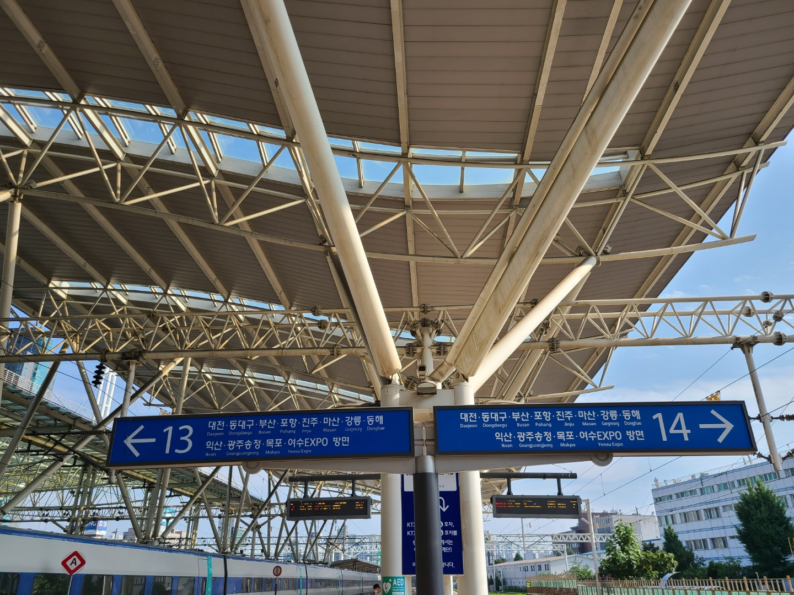
### 대전, 동대구, 부산, 포항, 진주, 마산, 강릉, 동해, 익산, 광주송정, 목포, 여수EXPO 방면   To Daejeon, Dongdaegu, Busan, Pohang, Jinju, Masan, Gangneung, Donghae,   Iksan, Gwangjusongjeong, Mokpo, Yeosu-EXPO

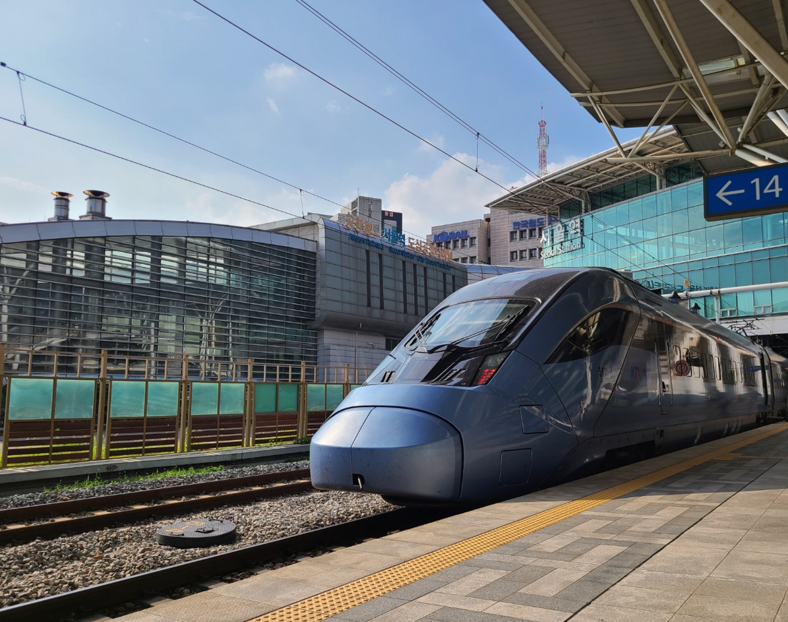
# Have a fun trip everyone! 즐거운 여행이 되세요!

## High-speed Train Lines in South Korea | 대한민국 고속철도 노선

### KTX 경부고속철도 | KTX Gyeongbu High-speed Rail 
 
 | **역명** | **Stations** |
 |----------|--------------|
 | 행신 | Haengsin |
 | 서울 | Seoul |
 | 광명 | Gwangmyeong |
 | 천안아산 | Cheonan-Asan |
 | 오송 | Osong |
 | 대전 | Daejeon |
 | 김천구미 | Gimcheon-Gumi |
 | 동대구 | Dongdaegu |
 | 경주 | Gyeongju |
 | 울산 (통도사) | Ulsan (Tongdosa) |
 | 부산 | Busan |

### KTX 호남고속철도 | KTX Honam High-speed Rail 
 
 | **역명** | **Stations** |
 |----------|--------------|
 | 행신 | Haengsin |
 | 서울 | Seoul |
 | 용산 | Yongsan |
 | 광명 | Gwangmyeong |
 | 천안아산 | Cheonan-Asan |
 | 오송 | Osong |
 | 공주 | Gongju |
 | 익산 | Iksan |
 | 정읍 | Jeongeup |
 | 광주송정 | Gwangjusongjeong |
 | 나주 | Naju |
 | 무안공항 | Muan Airport |
 | 목포 | Mokpo |

### SRT 수도권고속철도 | SRT Sudogwon/Gyeongbu High-speed Rail 
 
 | **역명** | **Stations** |
 |----------|--------------|
 | 수서 | Suseo |
 | 동탄 | Dongtan |
 | 평택지제 | Pyeongtaek-Jije |
 | 천안아산 | Cheonan-Asan |
 | 오송 | Osong |
 | 대전 | Daejeon |
 | 김천구미 | Gimcheon-Gumi |
 | 동대구 | Dongdaegu |
 | 경주 | Gyeongju |
 | 울산 (통도사) | Ulsan (Tongdosa) |
 | 부산 | Busan |

### SRT 수도권고속철도 | SRT Sudogwon/Honam High-speed Rail 
 
 | **역명** | **Stations** |
 |----------|--------------|
 | 수서 | Suseo |
 | 동탄 | Dongtan |
 | 평택지제 | Pyeongtaek-Jije |
 | 천안아산 | Cheonan-Asan |
 | 오송 | Osong |
 | 공주 | Gongju |
 | 익산 | Iksan |
 | 정읍 | Jeongeup |
 | 광주송정 | Gwangjusongjeong |
 | 나주 | Naju |
 | 무안공항 | Muan Airport |
 | 목포 | Mokpo |

### KTX 동해선  | KTX Donghae Line
 
 | **역명** | **Stations** |
 |----------|--------------|
 | 행신 | Haengsin |
 | 서울 | Seoul |
 | 광명 | Gwangmyeong |
 | 천안아산 | Cheonan-Asan |
 | 오송 | Osong |
 | 대전 | Daejeon |
 | 김천구미 | Gimcheon-Gumi |
 | 동대구 | Dongdaegu |
 | 포항 | Pohang |

### KTX 경전선 | KTX Gyeongjeon Line
 
 | **역명** | **Stations** |
 |----------|--------------|
 | 행신 | Haengsin |
 | 서울 | Seoul |
 | 광명 | Gwangmyeong |
 | 천안아산 | Cheonan-Asan |
 | 오송 | Osong |
 | 대전 | Daejeon |
 | 김천구미 | Gimcheon-Gumi |
 | 동대구 | Dongdaegu |
 | 밀양 | Miryang |
 | 진영 | Jinyeong |
 | 창원중앙 | Changwon-Jungang |
 | 창원 | Changwon |
 | 마산 | Masan |
 | 진주 | Jinju |

### KTX 전라선 | KTX Jeolla Line
 
 | **역명** | **Stations** |
 |----------|--------------|
 | 행신 | Haengsin |
 | 서울 | Seoul |
 | 용산 | Yongsan |
 | 광명 | Gwangmyeong |
 | 천안아산 | Cheonan-Asan |
 | 오송 | Osong |
 | 공주 | Gongju |
 | 익산 | Iksan |
 | 전주 | Jeonju |
 | 남원 | Namwon |
 | 곡성 | Gokseong |
 | 구례구 | Guryegu |
 | 순천 | Suncheon |
 | 여천 | Yeocheon |
 | 여수엑스포 | Yeosu-EXPO |

### KTX 경강선 | KTX Gyeonggang Line
 
 | **역명** | **Stations** |
 |----------|--------------|
 | 서울 | Seoul |
 | 청량리 | Cheongnyangi |
 | 상봉 | Sangbong |
 | 양평 | Yangpyeong |
 | 서원주 | Seowonju |
 | 만종 | Manjong |
 | 횡성 | Hoengseong |
 | 둔내 | Dunnae |
 | 평창 | Pyeongchang |
 | 진부(오대산) | Jinbu (Odaesan) |
 | 강릉 | Gangneung |

### KTX 영동선 | KTX Yeongdong Line
 
 | **역명** | **Stations** |
 |----------|--------------|
 | 서울 | Seoul |
 | 청량리 | Cheongnyangi |
 | 상봉 | Sangbong |
 | 양평 | Yangpyeong |
 | 서원주 | Seowonju |
 | 만종 | Manjong |
 | 횡성 | Hoengseong |
 | 둔내 | Dunnae |
 | 평창 | Pyeongchang |
 | 진부(오대산) | Jinbu (Odaesan) |
 | 정동진 | Jeongdongjin |
 | 묵호 | Mukho |
 | 동해 | Donghae |
 
### KTX 중앙선 | KTX Jungang Line
 
 | **역명** | **Stations** |
 |----------|--------------|
 | 서울 | Seoul |
 | 청량리 | Cheongnyangi |
 | 양평 | Yangpyeong |
 | 서원주 | Seowonju |
 | 원주 | Wonju |
 | 제천 | Jecheon |
 | 단양 | Danyang |
 | 풍기 | Punggi |
 | 영주 | Yeongju |
 | 안동 | Andong |
 | 의성 | Uiseong |
 | 영천 | Yeongcheon |
 | 경주 | Gyeongju |
 | 태화강 | Taehwagang |
 | 신해운대 | Sinhaeundae |
 | 부전 | Bujeon |

### KTX 중부내륙선 | KTX Jungbunaeryuk Line
 
 | **역명** | **Stations** |
 |----------|--------------|
 | 판교 | Pangyo |
 | 부발 | Bubal |
 | 가남 | Ganam |
 | 감곡장호원 | Gamgok-Janghowon |
 | 앙성온천 | Angseong-Oncheon |
 | 충주 | Chungju |
 | 살미 | Salmi |
 | 수안보 | Suanbo |
 | 연풍 | Yeonpung |
 | 문경 | Mungyeong |

 
