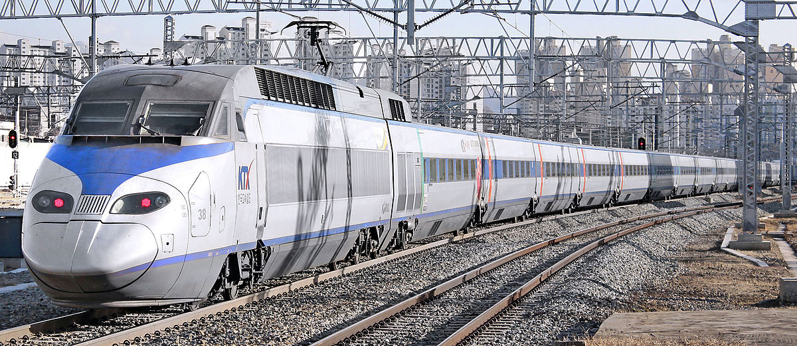
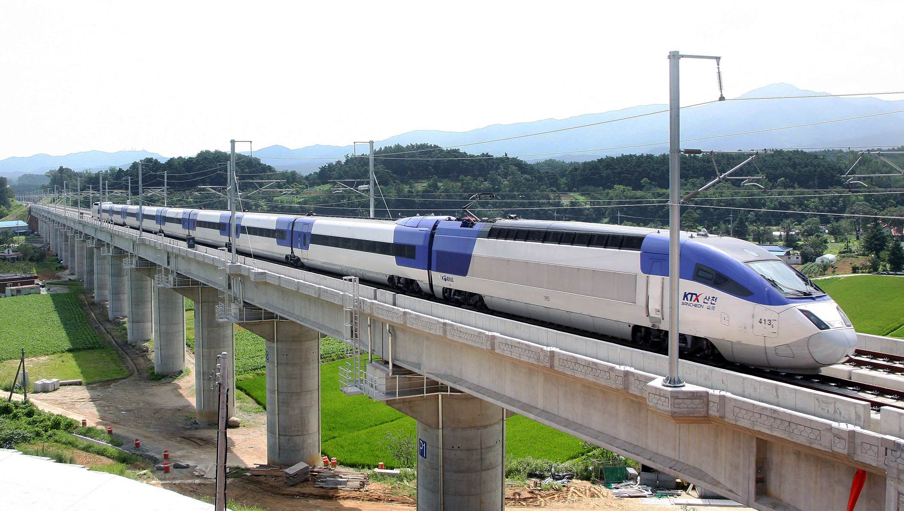
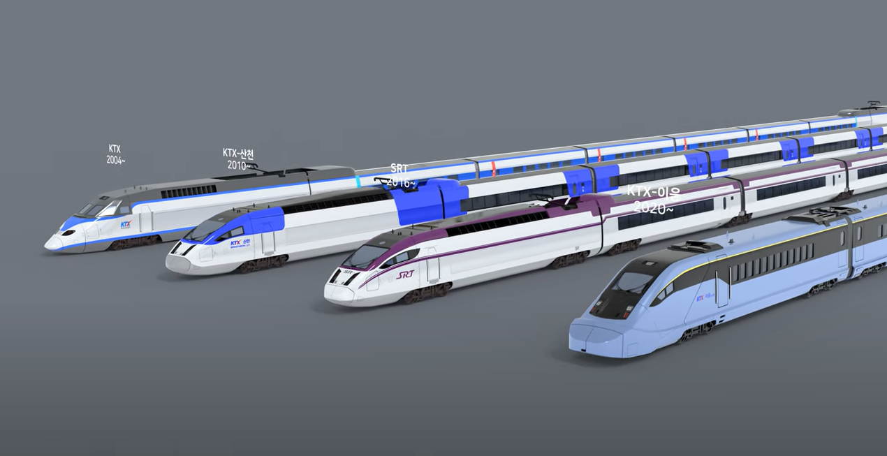
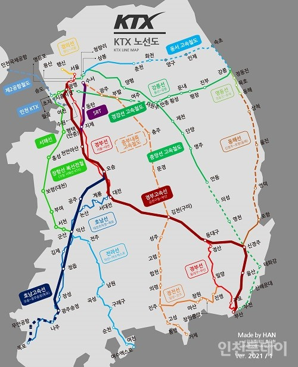

# KTX Classification Analysis
## Contributors:
- ### Louis Sungwoo Cho (조성우)

# Project Description
This project is about image classifcation of the high-speed train locomotives in South Korea, analyzing and predicting KTX (Korea Train eXpress) (한국고속철도) and SRT (Super Rapid Train) (수도권고속철도) passenger ridership. Random image datasets were given into the neural network model for image classification training and testing and the combined passenger ridership datasets used for analyzing and forecasting were acquired from KORAIL (한국철도공사) and SRT (수서고속철도주식회사). 

- #### Dataset Source: https://www.index.go.kr/potal/main/EachDtlPageDetail.do?idx_cd=1252

### KTX-1 the original French TGV model high-speed train approaching a station.
### 역으로 들어오는 프랑스에서 제작한 TGV 모델 KTX-1 고속열차.
- #### Image Source: https://en.wikipedia.org/wiki/Korea_Train_Express

### KTX-Sancheon model developed by Hyundai Rotem traveling along the Gangneung Line.
### 강릉선을 고속으로 주행하는 현대로템에서 제작한 KTX-산천 고속열차.
- ##### Image Source: https://www.archyworldys.com/only-56-minutes-from-cheongnyangni-to-jecheon-the-faster-and-strongerbullet-train-comes/

### KTX-EUM model developed by Hyundai Rotem passing Yangsu Bridge of the Jungang Line.
### 중앙선 양수철교 구간을 고속으로 통과하는 현대로템에서 제작한 KTX-이음 고속열차.
- #### Image Source: http://www.greenpostkorea.co.kr/news/articleView.html?idxno=69229

### SRT train developed by Hyundai Rotem passing Pyeongtaek Jije Station. 
### 평택지제역을 통과하는 현대로템에서 제작한 SRT 고속열차.
- #### Image Source: https://www.srail.or.kr/cms/article/view.do?postNo=39&pageId=KR0502000000

# Motivation
South Korea first opened their high-speed rail network on April 1st, 2004 to make rail travel time more fast and convenient. When I first traveled to South Korea, my family introduced me to a new bullet train which took into service called KTX. I was excited to ride a high-speed train for the first time because U.S.A unfortunately still does not have bullet trains. After nearly 2 decades the first KTX line the Gyeongbu High-Speed Line (경부고속선) connecting Seoul to Busan opened, the high-speed rail network has expanded almost throughout the entire country including the Honam High-Speed Line (호남고속선) connecting Seoul to Gwangju-Songjeong to Mokpo, Suseo High-Speed Line or Sudogwon-High Speed Line (수서고속선/수도권고속선) connecting the south side of Seoul Suseo to Busan and Gwangju, Gyeongjeon Line (경전선) connecting Seoul to Masan to Jinju, Jeolla Line (전라선) connecting Seoul to Yeosu-EXPO, Donghae Line (동해선) connecting Seoul to Pohang, Gangneung Line (강릉선) also known as the 2018 Pyeongchang Olympics Line connecting Seoul to Gangneung, Yeongdong Line (영동선) connecting Seoul to Donghae, Jungang Line (중앙선) connecting Seoul to Andong (sections to Uiseong, Yeongcheon, Singyeongju, Taehwagang, Busan-Bujeon to be opened in December 2023), and the Jungbu-Naeryuk Line (중부내륙선) connecting Bubal to Chungju. As seen above, due to the continuing expansion of the South Korean high-speed train network, Hyundai ROTEM has designed many different types of locomotive to serve in various lines depending on their operational speed respectively. Due to each locomotive having unique features, I decided to create a deep learning model that can classify the 4 types of trains in operation: KTX-1, KTX-EUM, KTX-Sancheon, and SRT. 

#### From left to right KTX-1, KTX-Sancheon, SRT, KTX-EUM (왼쪽부터 KTX-1, KTX-산천, SRT, KTX-이음)
- #### Image Source: https://www.youtube.com/watch?v=pSFV4Nh2hJo

### Map of the entire high-speed rail network in South Korea (대한민국 고속철도망)
- #### Image Source: https://www.incheontoday.com/news/articleView.html?idxno=205643

# Image Preparation
Random South Korean high-speed train image datasets were used to train the neural network model for image classification. 40 files were then split into 4 categories with each category having 10 images of the same class. 

### Figure 1. above shows the 10 random KTX-1 images from the given image dataset.

### Figure 2. above shows the 10 random KTX-EUM images from the given image dataset.

### Figure 3. above shows the 10 random KTX-Sancheon images from the given image dataset.

### Figure 4. above shows the 10 random SRT images from the given image dataset.

Once all the random image datasets were printed out, the entire image dataset was split into training and testing sets. 80% of the total image datasets were used for training and the remaining 20% of the total image datasets were used for testing. The epochs number was set to 20 so the training model was run for 20 times. Then all the data were shuffled before the neural network model was created. 

# Convolutional Neural Network (CNN) Model
Convolutional Neural Network (CNN) model was used to classify the high-speed train images. One of the biggest advantage of using CNN models is that the neural network is able to detect the important features into several distinct classes from the given image datasets without any human supervision and also being computationally efficient. Hence, this deep learning model was chosen to train all the high-speed trains image datasets for this project. 

### Figure 5. above shows how the cnn model processes the image dataset with series of convolution and pooling before flattening out the image to predict the output.
